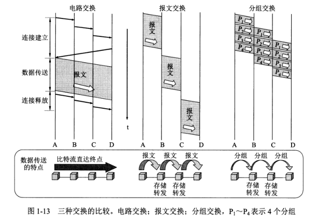
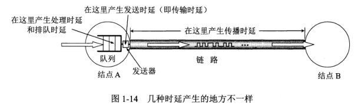

1.概述
1.1 计算机网络再信息时代中的作用
21世纪重要特征：数字化、网络化、信息化，是一个以网络为核心的信息时代
三大类网络：电信网络、有线电视网络、计算机网络。
  电信网络：向用户提供电话、电报及传真等服务；
  有线电视网络：向用户传送各种电视节目；
  计算机网络：使用户能够在计算机之间传送数据文件。
Internet:因特网/互联网，由数量极大的各种计算机网络互连起来的，覆盖全球的。
  一个专用名词，它指当前全球最大的、开放的、由众多网络Markdown Preview Github Styling相互连接而成的特定互连网，它采用TCP/IP协议族作为通信的规则，且其前身是美国的ARPANET。
Internet是人类自印刷术发明以来在存储和交换信息的领域中的最大变革
互联网两个重要基本特点：
  连通性(connectivity):
  共享:资源共享

计算机网络(简称为网络)：由若干**结点**(node)和连接这些结点的链路(link)组成
  结点：计算机、集线器、交换机、路由器等
internet/internetwork：互连网,网络的网络(network of networks)
  一个通用名词，泛指由多个计算机网络互连而成的计算机网络。在这些网络之间的通信协议（即通信规则）可以任意选择，不一定非要使用TCP/IP协议
主机(host):与网络相连的计算机
网络把许多计算机连接在一起，而互连网则把许多网络通过路由器连接在一起。与网络相连的计算机常称为主机。
三级结构的互连网：主干网、地区网、校园网/企业网
互联网基础结构发展的三个阶段：
  1.从单个网络ARPANET香互连网发展的过程；
  2.建成了三级结构的互联网；
  3.逐渐形成了多层次ISP结构的互联网
互联网服务提供商/者/ISP(Internet Service Provider)：中国电信、中国联通、中国移动
  主干ISP:由几个专门的公司创建和维持，服务面积最大（一般都能够覆盖国家范围），并且还拥有高速主干网
  地区ISP:一些较小的ISP。通过一个或多个主干ISP连接起来
  本地ISP:给用户提供直接的服务，可与地区ISP或主干ISP连接
互联网交换点IXP:(Internet eXchange Ponit):允许两个网络直接相连并交换分组，而不需要再通过第三个网络来转发分组
万维网WWW(World Wide Web)

ISOC互联网协会(Internet Society)
  IAB互联网体系结构委员会(Internet Architecture Borard):负责管理互联网有关协议的开发
    IETF互联网工程部(Internet Engineering Task Force):由许多工作组WG(Working Group)组成的论坛(forum),具体工作由互联网工程指导小组IESG(Internet Enginerring Sterring Group)股那里。这些工作组划分为若干个领域(area)，每个领域集中研究某一特定的短期和中期的工程问题，主要是针对协议的开发和标准化
    IRTF互联网研究部(Internet Research Task Force):由一些研究组RG(Research Group)组成的论坛，具体工作由互联网研究知道小组IRSG(Internet Research Steering Group)管理。IRTF的任务是研究一些需要长期考虑的问题，包括互联网的一些协议、应用、体系结构等
互联网标准都是以RFC的形式再互联网上发表的
RFC(Request For Comments):"请求评论"。
制定互联网的正式标准三个阶段：
  互联网草案(Internet Draft):有效期只有6个月
  建议标准(Proposed Standard):成为RFC文档
  互联网标准(Internet Standard):每个标准分配一个编号STD xx,一个标准可以和多个RFC文档关联。

## 1.3 互联网的组成：
  **边缘部分**：由所有连接再互联网上的主机组成。**用户直接使用**的，用来进行通信(传送数据、音频或视频)和资源共享
  
  **核心部分**：由大量网络和连接这些网络的路由器组成。**为边缘部分提供服务的**(提供连通性和交换)

端系统(end system)：处再互联网边缘的部分，即连接在互联网上的所有的主机
  端：末端，互联网的末端。
计算机之间的通信：主机A的某个进程和主机B上的另一个进程进行通信
客户和服务器：计算机进程(软件)
端系统之间的通信方式：
  客户-服务器方式(C/S方式):最常用的、传统的。客户是服务请求方，服务器是服务提供方
    客户程序：
      (1)被用户调用后运行，在通信时主动向远地服务器发起通信(请求服务)。客户程序必须知道服务器程序的地址。
      (2)不需要特殊的硬件和很复杂的操作系统。
    服务器程序：
      (1)是一种专门用来提供某种服务的程序，可同事处理多个远地或本地客户的请求。
      (2)系统启动后即自动调用并一直不断地运行着，被动地等待并接受来自各地的客户的通信请求。服务器程序不需要知道客户程序的地址
      (3)一般需要有强大的硬件和高级的操作系统支持
  对等方式(P2P方式)：对等连接(peer-to-peer),两台主机在通信时并不区分哪一个是服务请求方哪一个是服务提供方。
    本质仍然是客户-服务器方式，只是对等连接中的每一台主机既是客户又同事是服务器。

路由器(router):专用计算机(但不叫主机)。是实现分组交换(packet switching)的关键构件，其任务是转发收到的分组。

电路交换(circuit seitching)：必须经过”建立连接(占用通信资源)->通话(一直占用通信资源)->释放连接(归还通信资源)"三个步骤的交换方式。
  交换(switching)：按照某种方式动态地分配传输线路的资源
  特点：再通话的全部时间内，通话的两个用户始终占用端到端的通信资源

分组交换：采用存储转发技术。
  邮政通信
要发送的整块数据称为一个报文(message)。在发送报文前，先把较长的报文划分为一个个更小的等长数据段，在每个数据段前面，加上一些由必要的控制信息组成的首部(header)后，就构成了一个分组(packet)。分组又称为"包",而分组的首部也可称为"包头"。分组是在互联网中传送的数据单元。分组的首部包含了目的地址和源地址等重要控制信息
互联网核心部分的路由器一般都用高速链路相连接，而在网络边缘的主机接入到核心部分则通常以相对较低速率的链路相连接。
主机是为用户进行信息处理的，并且可以和其他主机通过网络交换信息。
路由器则是用来转发分组的，即进行分组交换的。
各路由器之间必须经常交换彼此掌握的路由细腻些，以便创建和动态维护路由器中的转发表，使得转发表能够在整个网络拓扑发生编号时及时更新。
路由器暂时存储的是一个个短分组，而不是整个的长报文。短分组是暂时存在路由器的存储器(即内存)中而不是存储在磁盘中的。这就保证了较高的交换速率。
分组在传输时一段一段地断续占用通信资源，而且还省去了建立连接和释放连接的开销，因而数据的传输效率更高
分组交换的优点：
  高效：在分组传输的过程中动态分配传输带宽，对通信链路是逐段占用
  灵活：为每一个分组独立地选择最合适的转发录音
  迅速：以分组作为传送单位，可以不先简历连接就能向其他主机发送分组
  可靠：保证可靠性的网络协议：分布式多录音的分组交换网，使网络有很好的生存性
分组交换的问题：
  在各路由器存储转发时需要排队，会造成一定的时延
  无法确保通信时端到端所需的带宽
  各分组必须携带的控制信息造成了一定的开销(overhead)
  整个分组交换网还需要专门的管理和控制机制

报文交换(message switching):电报通信：基于存储转发原理的报文交换

主要区别：
  电路交换：整个报文的比特流连续地从源点直达终点，好像在以恶搞管道中传送。
  报文交换：整个报文先传送到相邻结点，全部存储下来后查找转发表，转发到下一个结点。
  分组交换：单个分组(这只是整个报文的一部分),传送到相邻结点，存储下来后查找转发表，转发到下一个结点。

1994.4.20.我国用64 kbit/s专线正式连入互联网。从此，我国被国际上正式承认为接入互联网的国家。5月中国科学院高能物理研究所设立了我国的第一个万维网服务器
规模最大的五个公用计算机网络：
  中国电信互联网CHINANET(原来的中国公用计算机互联网)
  中国联通互联网UNINET
  中国移动互联网CMNET
  中国教育和科研计算机网CERNET
  中国科学技术网CSTNET
中国互联网络信息中心CNNIC(China Network Information Center)
网民：过去半年内使用过互联网的6周岁以上的中国居民

计算机网络定义：计算机网络主要是由一些通用的、可编程的硬件互连而成的，而这些硬件并非专门用来实现某一特定目的(列如,传送数据或视频信号),这些可编程的硬件能够用来粗汉宋多种不同类型的数据，并能支持广泛的和日益增长的应用
  可编程硬件：包含中央处理机CPU
  计算机网络所连接的硬件，并不限于一般的计算机，而是包括的智能手机
  计算机网络并非专门用来传送数据，而是能够支持很多种的应用(通信、视频、音频等)

按照网络的作用范围进行分类：
  广域网WAN(Wide Area Network):作用范围通常为几十到几千公里，也称远程网(long haul network)，可跨越不同的国家。是互联网的核心部分，其任务是通过长距离运送主机所发送的数据。连接广域网的各结点交换机的链路一般都是高速链路，具有较大的通信容量。
  城域网MAN(Metropolitan Area Network):作用范围一般是一个城市，可跨越几个街区甚至整个城市，其作用距离约为5~50km.可以为一个或几个单位所拥有，但也可以是一种公用设施，用来将多个局域网进行互连。很多城域网采用的是以太网技术
  局域网LAN(Local Area Network):局域网一般用微型计算机或工作站通过高速通信线路相连(速率通常在10Mbit/s以上)，但地理上则局限在较小的范围(如1km左右).校园网/企业网：学校/企业多个互连的局域网
  个人区域网PAN(Personal Area NetWork):在个人工作的地方把个人使用的电子设备(如便捷式电脑等)用无线技术连接起来的网络，也称为无线个人区域网WPAN(Wireless PAN),范围很小，大约在10m左右
中央处理机之间的距离非常近，则一般称为多处理机系统而不称为计算机网络

按照网络的使用者进行分类：
  公用网(public network):电信公司(国有或私有)出资建造的大型网络。
    公用：所有意愿按电信公司的规定交纳费用的人都可以使用这种网络。也称公众网。
  专用网(private network):某个部门为满足本单位的特殊业务工作的需要而建造的网络。这种网络不向本单位以外的人提供服务

用来把用户接入到互联网的网络：
  接入网AN(Access Network):本地接入网/居民接入网。不属于互联网的核心部分，也不属于边缘部分。是从某个用户端系统到互联网种的第一个路由器（边缘路由器)之间的一种网络。从覆盖的范围看，很多接入网属于局域网。从作用上看，接入网是起到让用户能够与互联网连接的”桥梁“作用。
    电话拨号接入、宽带接入

计算机网络的性能
  计算机网络的性能指标:
    1.速率：网络技术中的速率指的是数据的传送速率,也称为数据率(data rate)/比特率(bit rate)。为额定速率或标称速率，而非实际上运行的速率。是计算机网络中最重要的一个性能指标。单位是bit/s(比特每秒)或b/s或bps(bit per second)
      K(kilo)=103=千
      M(Mega)=106=兆
      G(Giga)=109=吉
      T(Tera)=1012=太
      P(Peta)=1015=拍
      E(Exa)=1018=艾
      Z(Zetta)=1021=泽
      Y(Yotta)=1024=尧
    2.带宽(bandwidth)：
      (1)频域称谓。某个信号具有的频带宽度。信号的带宽是指该信号所包含的各种不同频率成分所占据的频率范围。单位是赫(或千赫、兆赫、吉赫等)。在过去的很长一段时间内，通信的主干线路传送的是模拟信号(即连续变化的信号)。表示某信道允许通过的信号频带范围就称为该信道的带宽（或通频带）
      (2)时域称谓。在计算机网络中，带宽用来表示网络中某通道传送数据的能力，因此网络带宽表示在单位时间内网络中的某信道所能通过的”最高数据率“。单位：数据率的单位bit/s,比特每秒
    3.吞吐量(throughput):在单位时间内通过某个网络（或信道、接口）的实际的数据率。
    4.时延(delay/latency)/延迟/迟延：数据（一个报文或分组，甚至比特）从网络（或链路）的一端传送到另一端所需的时间。
      (1)发送时延(transmission delay)/传输时延：主机或路由器发送数据帧所需要的时间。
        计算公式：
          发送时延=数据帧长度(bit)/发送速率(bit/s)
      (2)传播时延(propagation delay)：是电磁波在信道中传播一定的距离需要花费的时间。
        计算公式：
          传播时延=信道长度(m)/电磁波在信道上的传播速率(m/s)
    发送时延发生在机器内部的发送器中(一般就是发生在网络适配器中) ，与传输信道的长度（或信号传送的距离）没有任何关系。
    传播时延则发生在机器外部的传输信道媒体上，而与信号的发送速率无关。信号传送的距离越远，传播时延就越大。 
    5.处理时延：主机或路由器在收到分组时要花费一定的时间进行处理，列入分析分组的首部、从分组中提取数据部分、进行差错检验或查找适当的路由等。
    6.排队时延：分组在经过网络传输时，要经过许多路由器。但分组在进入路由器后要先在输入队列中排队等待处理。在路由器确定了转发接口后，还要输出队列中排队等待转发。排队时延的长短往往取决于网络当时的通信量。当网络的通信量很大时会发生队列溢出，使分组丢失，这相当于排队时延为无穷大。
数据在网络中经历的总时延：
  总时延=发送时延+传播时延+处理时延+排队时延
  
一般说来，小时延的网络要优于大时延的网络。在某些情况下，一个低速率、小实验的网络很可能要优于一个高速率但大时延的网络
1GB=1024MB=210MB
1MB=1024KB=210KB
1KB=1024B=210B(字节Byte)
1B(字节)=8bit(比特)
长度为100MB的数据块，在带宽为1Mbit/s的信道上连续发送，发送时延：
  100×220×8÷106=838.9s
对于高速网络链路，我们提高的仅仅是数据的发送速率而不是比特在链路上的传播速率
提高数据的发送速率只是减小了数据的发送时延。
数据的发送速率单位是每秒发送多少个比特m,是指在某个点或某个接口上的发送速率
传播速率的单位是每秒传播多少公里，是指在某一段传输线路上比特的传播速率
  5.时延宽带积

  非性能特征(nonperformance characteristics)
比特(bit):binary digit,二进制数字。一个比特就是二进制数字中的一个1或0。
比特也是信息论中使用的信息量的单位

# 运输层
### UDP用户数据报协议
UDP有两个字段：数据字段+首部字段
1.无连接的
  发送数据前不需要建立连接，减少开销和发送数据之前的时延
2.尽最大努力交付
  不保证可靠交付，主机不需要维持复杂的连接状态表
3.面向报文
  应用层交下来的报文，添加首部后就向下交付IP层，即保留这些报文的边界，不合并不拆分
  IP层交上来的UPD用户数据报，去除首部就交付应用层
  所以 应用层需选择合适大小的报文
4.没有拥塞控制
  网络出现的拥塞不会使源主机的发送速率降低。使用实时应用如IP电话、视频会议等
5.支持一对一、一对多、多对一和多对多的交互通信
6.首部开销小
  8个字节（TCP首部20个字节）

#### UDP首部格式
8字节，4个字段组成
1.源端口(2字节)
  源端口号。需要对方回信时炫耀。不需要时可用全0
2.目的端口(2字节)
  目的端口号。
3.长度(2字节)
  UDP的长度，最小值为8(仅有首部)
4.校验和(2字节)
  检测UDP在传输中是否有错。有错就丢弃
  计算伪首部需要：源IP地址(4字节)+目的IP地址(4字节)+0(1字节)+17(1字节)+UDP长度(2字节)

### TCP传输控制协议
1.面向连接的运输层协议
  必须先建立TCP连接，传送数据完毕后，释放TCP连接
2.点对点/一对一
  每一条TCP连接只能有两个端点(endpoint)
3.可靠交付
  无差错、不丢失、不重复、按序到达
4.全双工通信
  TCP连接的两端都设有发送缓存和接收缓存
5.面向字节流
  “流”（stream)：流入到进程活从进程流出的字节序列
  把数据看错一连串无结构的字节流，根据当前网络拥塞程度和对方给出的窗口值来决定一个报文断包含多少字节

